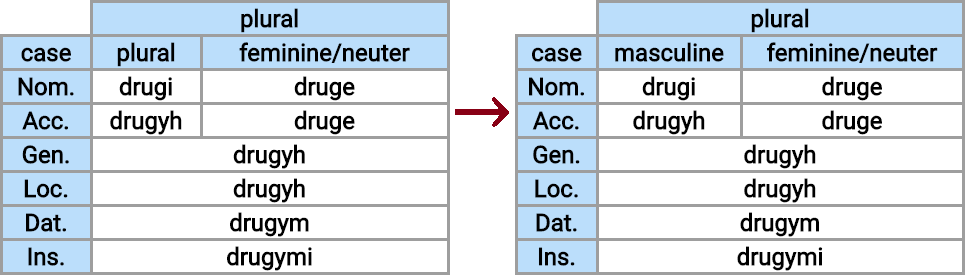

# Contribute to the Interslavic Dictionary project

First of all, thanks for taking the time to contribute.

Here you can discover how you can help the project and find the [guidelines](#guidelines) for your contribution type.

* [Fix a wrong or a missing translation](#fix-a-translation)
* [Fix an incorrect word form](#fix-word-form)
* [Fix a bug in the user interface](#fix-ui-bug)
* [Add a new feature](#add-a-feature)
* [I have something else...](#something-else)

If you need to check a particular [HOW-TO](#how-to), below is a small table of contents for your convenience:

* [Obtaining write access to Google Spreadsheets](#google-spreadsheets)
* [Local environment setup](#local-environment-setup)

# Guidelines

## Fix a wrong or a missing translation

You wish to fix a missing (automatic) translation, or the translation is inaccurate or incomplete, e.g.:

This repository does not store the translations themselves; they are located and maintained at Google Sheets [here](https://docs.google.com/spreadsheets/d/1N79e_yVHDo-d026HljueuKJlAAdeELAiPzdFzdBuKbY). Leave a comment to the document or see [Obtaining write access to Google Spreadsheets](#google-spreadsheets).

## Fix an incorrect word form

First of all, [open an issue](#opening-an-issue) to get initial feedback and consensus on the correct word forms.

If you feel confident enough around JavaScript code, you could try fixing the problem yourself, here is the workflow:

1. [Set up the repository locally](#local-environment-setup).
1. Align the test snapshots with the up-to-date dictionary contents from Google Sheets using `npm run updateTestSnapshot` and `git commit` the changed files.
1. Edit the code responsible for word inflection — most likely you'll need [this folder](https://github.com/scherebedov/interslavic/tree/master/src/legacy).
1. Run the unit tests and review the errors — that way you'll see what the scope of your change is.
1. Once you are sure that your change fixes the issue and does not create any new ones, make another Git commit with your fix and the updated snapshots (yes, run `npm run updateTestSnapshot` for the second time).
1. Create a pull request and pass the review process to get it merged.

## Fix a bug in the user interface

See: [opening an Issue](#opening-issue)

If you want to track and fix the problem yourself, you should look into [local environment setup](local-environment-setup). Having some knowledge of TypeScript and React framework would help here.

## Add or request a new feature

We conform to the usual git workflow ('gitflow'). If you have a proof-of-concept, feel free to create a pull request; otherwise, open an issue.

## I have something else...

# HOW-TO

## Obtaining write access to Google Spreadsheets

You should go straight to the [new_interslavic_words_list](https://docs.google.com/spreadsheets/d/1N79e_yVHDo-d026HljueuKJlAAdeELAiPzdFzdBuKbY) document in _Google Sheets_ and request edit access:

In the text area you should briefly describe what translation issue you have found, and also specify what languages you know at level of a native speaker to get edit access to the respective translation columns:

When you gain the access, open a comment at the respective spreadsheet cell that contains the translation issue, or edit that cell yourself in case when the issue is minor and trivial.

Please join the work on improving word translations for your native language!

## Opening an issue

## Local environment setup

You need to perform the following steps:

1) Install `node.js`: https://nodejs.org/en/download/

The next steps should be done with the help of command line interface.

2) run `git clone https://github.com/scherebedov/interslavic`

3) run `npm install` inside the directory created

4) `npm run generateDictionary`

5) `npm start` (`Ctrl+C` to stop)

6) Navigate to `localhost:3000` or  `http://0.0.0.0:3000/` in your browser.

The code changes should take effect after refresh (`F5`). In some cases, it could be necessary to repeat `npm install` and/or `npm start` commands.

## Code of Conduct

See [Contributor Covenant](https://www.contributor-covenant.org/translations).

## Project maintainers

The Interslavic Dictionary project maintainers are the people accepting or rejecting any PR.
Although anyone can review PRs, only the acknowledgement from an Approver counts towards the approval of a PR.
This repository is configured to require one approval from the repository-specific approval team before a PR can be merged.
