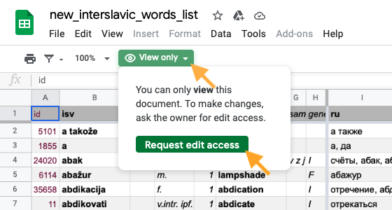

# Contribute to the Interslavic Dictionary project

First of all, thanks for taking the time to contribute.

Here you can discover how you can help the project and find the [guidelines](#guidelines) for your contribution type.

* [Fix a wrong or a missing translation](#fix-a-translation)
* [Fix an incorrect word form](#fix-word-form)
* [Fix a bug in the user interface](#fix-ui-bug)
* [Add a new feature](#add-a-feature)
* [I have something else...](#something-else)

If you need to check a particular [HOW-TO](#how-to), below is a small table of contents for your convenience:

* [Obtaining write access to Google Spreadsheets](#google-spreadsheets)
* [Local environment setup](#local-environment-setup)

## Guidelines

## Fix a wrong or a missing translation

You wish to fix a missing (automatic) translation, or the translation is inaccurate or incomplete, e.g.:

In this case, you should go straight to the [new_interslavic_words_list](https://docs.google.com/spreadsheets/d/1N79e_yVHDo-d026HljueuKJlAAdeELAiPzdFzdBuKbY) document in _Google Sheets_ and request edit access:

In the text area you should briefly describe what translation issue you have found, and also specify what languages you know at level of a native speaker to get edit access to the respective translation columns:

When you gain the access, open a comment at the respective spreadsheet cell that contains the translation issue, or edit that cell yourself in case when the issue is minor and trivial.

Please join the work on improving word translations for your native language!

## Fix an incorrect word form

Kod, odgovorny/odpovědalny za tutu možlivost, nahoditi se v <<LINK>>. My imajemo nadeju, že on jest razumliv bez znanja programovanja.

Ako li ne, delaj takože jak 2. 

## Fix a bug in the user interface

Iztvori sde kvestiju (`Issue`), v kojej napiši, čto liho jest. Ako li hočeš davati pomoč --- gledi v sekciji ob instalaciju.

## Add a new feature

My pracujemo v paradigmu Git WorkFlow. Tebe potrebno izdelati kvestiju (`issue`) ili `pull request`.

## I have something else...

## HOW-TO

## Obtaining write access to Google Spreadsheets

...

## Local environment setup

Povinno se naslědny kroki sovršiti:

1) izdelati instalaciju node.js: https://nodejs.org/en/download/

Naslědny kroki potrebno delati v konsoli/terminale.

2) izdelati `git clone https://github.com/<<>>/interslavic`

3) vnutri tutoj direktorii izdelati `npm install`

4) `npm run generateDictionary`

5) `npm start`

6) idi v brauzere do `localhost:3000` ili  `http://0.0.0.0:3000/` (`Ctrl+C` za postojku)

Posle popravok koda potrebno osvěžiti stranicu brauzera (`F5`). Poněkogda može potrěbovati si povtarjati `npm install` i `npm start`.

## Code of Conduct

See [https://www.contributor-covenant.org/translations](Contributor Covenant).

## Contact

The Kata Containers community can be reached
[through various channels](README.md#join-us).

## Project maintainers

The Interslavic Dictionary project maintainers are the people accepting or rejecting any PR.
Although anyone can review PRs, only the acknowledgement from an Approver counts towards the approval of a PR.
This repository is configured to require one approval from the repository-specific approval team before a PR can be merged.
