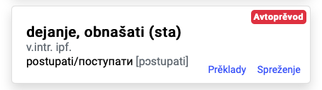
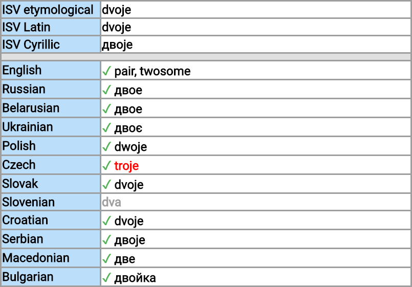
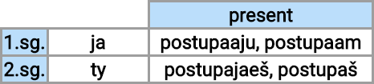
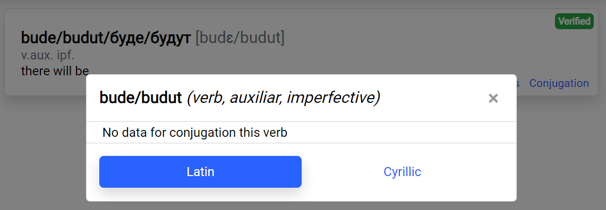

# Pomoži proektu Slovnika Medžuslovjanskogo jezyka!

Najprvo, my blagodarimo tebe za ohotu pomogti s razvivanjem slovnika. 

Tut ty možeš srazuměti, jak pomogti proekty i najdti [direktivy](#guidelines) ob različnyh vkladah:

* [Ja vidžu pogrešku v prěkladu](#fix-a-translation)
* [Ja vidzu pogresku v sklonjenjah ili v spreženjah](#fix-word-form)
* [Ja vidzu pogrešku v interfejse](#fix-ui-bug)
* [Ja hču poprositi ili izdelati novu možlivost](#add-a-feature)
* [I have something else...](#something-else)

Ako li ty hočeš pročitati někuju rady ob [JAK-IZDELATI](#how-to):

* [Jak dobyti pravo redagovati Gugl Tabely](#google-spreadsheets)
* [Jak instalaciti i izměnjati slovnik na mojem kompjutere](#local-environment-setup)

# Direktiva

## Ja vidžu pogrešku v prěkladu

Prěklady mogut byti ne prověrjenymi (byti avtomatičnymi), ili byti nepravilnymi/necělkovitymi.

Vsi prěklady uměščeny v Gugl Tabelah (Google Spreadsheets: <<LINK>>). Najlěpša metoda napraviti prěklad --- ostaviti tam komentar. Takože ty može stati redaktorom, gledi [Jak dobyti pravo redagovati Gugl Tabely](#google-spreadsheets).

## Ja vidzu pogresku v sklonjenjah ili v spreženjah

Gledi: [otvorjenje kvestiji](#issue)

Ci ty hočeš li popraviti tuto sam? Kod, odgovorny/odpovědalny za tutu možlivost, nahoditi se [tam](https://github.com/scherebedov/interslavic/tree/master/src/legacy). My imajemo nadeju, že on jest razumliv bez velikogo znanja programovanja.

## Ja vidzu pogrešku v interfejse.

Gledi: [otvorjenje kvestiji](#issue)

Ako li ty hočeš najdti i počiniti pogrešku sam, tebe se povinno pročitati ob [lokalnoj instalaciji](local-environment-setup). Budet pomočnostju uměnje koristati TypeScript i opravu React.

## Ja hču poprositi ili izdelati novu možlivost

My pracujemo v paradigmu git workflow ('gitflow'). Ako li ty imaješ prototip, sotvori `pull request`; jestli ne, togda tebe potrebno izdelati kvestiju (`issue`).

# JAK IZDELATI...

## Jak instalaciti i izměnjati slovnik na mojem kompjutere?

Povinno se naslědny kroki sovršiti:

1) izdelati instalaciju node.js: https://nodejs.org/en/download/

Naslědny kroki potrebno delati v konsoli/terminale.

2) izdelati `git clone https://github.com/<<>>/interslavic`

3) vnutri tutoj direktorii izdelati `npm install`

4) `npm run generateDictionary`

5) `npm start`

6) idi v brauzere do `localhost:3000` ili  `http://0.0.0.0:3000/` (`Ctrl+C` za postojku)

Posle popravok koda potrebno osvěžiti stranicu brauzera (`F5`). Poněkogda može potrěbovati si povtarjati `npm install` i `npm start`.

## Jak dobyti pravo redagovati Gugl Tabely?

My zovemo tebe v tutoj document: [new_interslavic_words_list](https://docs.google.com/spreadsheets/d/1N79e_yVHDo-d026HljueuKJlAAdeELAiPzdFzdBuKbY). Potom poprosi dostup na redagovanje:

In the text area you should briefly describe what translation issue you have found, and also specify what languages you know at level of a native speaker to get edit access to the respective translation columns:

When you gain the access, open a comment at the respective spreadsheet cell that contains the translation issue, or edit that cell yourself in case when the issue is minor and trivial.

Please join the work on improving word translations for your native language!

